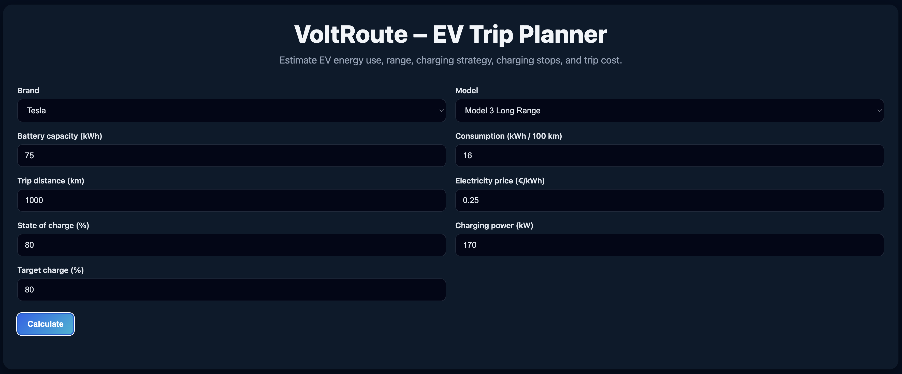
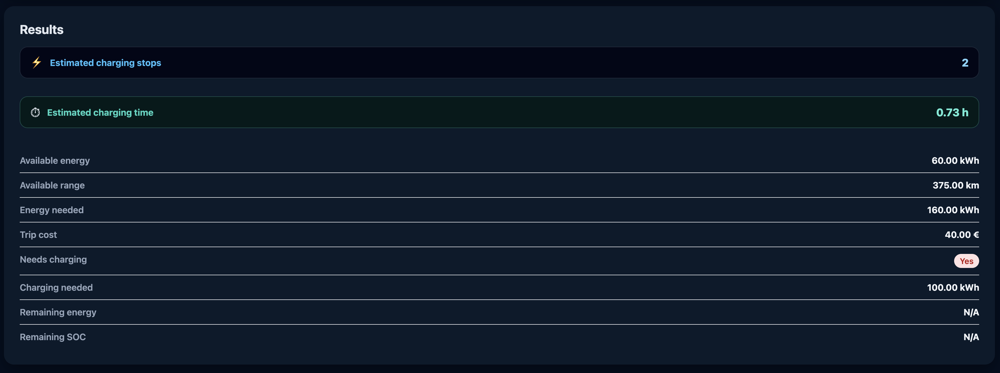

# VoltRoute – EV Trip Planner

# VoltRoute – EV Trip Planner


```markdown


Modern EV trip planning tool that estimates **range, charging stops, charging time, and trip cost** based on realistic electric vehicle behavior.

---

## Features

- Battery & consumption based range calculation
- Charging stops estimation
- Charging time simulation with SOC-based charging curve
- Target charge strategy (e.g. 60% / 80%)
- Vehicle presets (brand + model)
- Trip cost calculation
- Modern dark UI with highlighted key metrics

---

## Key Concept

Unlike basic calculators, VoltRoute simulates **real-world EV charging behavior**:

- Charging slows down at higher SOC levels
- Optimal strategy is not always 100% charging
- Multiple short charging stops can be faster than one long charge

---

## UI Overview

### Main Input Panel
- Battery capacity
- Consumption
- Distance
- Electricity price
- State of charge
- Charging power
- Target charge strategy

### Results
- ⚡ Charging stops (highlighted)
- ⏱ Charging time (highlighted)
- Available range
- Energy needed
- Trip cost
- Remaining SOC

---

## Calculation Logic

### Charging Curve (simplified model)

| SOC range | Charging speed |
|----------|---------------|
| 0–20%    | 85% power     |
| 20–60%   | 100% power    |
| 60–80%   | 65% power     |
| 80%+     | 30% power     |

Charging is simulated in small SOC steps for realism.

---

### Charging Strategy

User-defined:

- 60% → faster stops, more stops  
- 80% → slower stops, fewer stops  

---

## Tech Stack

- **F#**
- **WebSharper UI**
- Reactive UI (Var / View)
- Functional domain logic

---

## Run locally

```bash
dotnet run
```

Then open the URL shown in the terminal (e.g. http://localhost:56910)

---

## Project Structure

```text
VoltRoute/
├── src/
│   ├── Client.fs              # UI logic (WebSharper SPA)
│   ├── Calculations.fs        # EV trip calculation engine
│   ├── VehiclePresets.fs      # Predefined EV models
│   ├── TripAnalysis.fs        # Extended analysis / future features
├── wwwroot/
│   ├── custom.css             # Styling (dark UI + dashboard)
├── index.html                 # Entry point
```

---

## Screenshots

### Main UI


### Results Panel


---

## Live Demo

https://voltroute.onrender.com

## Author

Richárd Szőke
GNMH44
Software Engineering Student

---